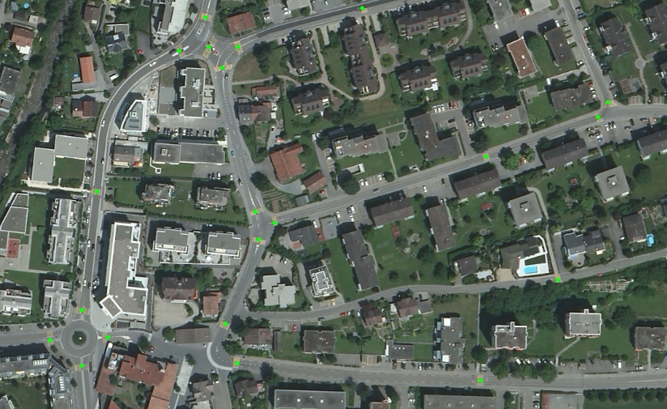
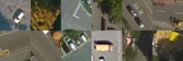

[](LICENSE)
[](https://www.codacy.com/app/marcelhuberfoo/OSM-Crosswalk-Detection)
[](https://circleci.com/gh/geometalab/OSM-Crosswalk-Detection)
[](http://waffle.io/geometalab/OSM-Crosswalk-Detection)


# OSM-Crosswalk-Detection: Deep learning based image recognition

## Introduction

OSM-Crosswalk-Detection is a highly scalable image recognition software for aerial photos (orthophotos). It uses the deep learning library Keras, more precisely a VGGNet like convolutional neural network, to detect crosswalks along streets.
This Python based project provides a Keras docker container to train the neural network on a GPU and several docker containers to distribute the recognition work on multiple servers.

This work started as part of a semester thesis autumn 2015 at Geometa Lab, University of Applied Sciences Rapperswil (HSR).

## Overview


## Examples


Picture 1: Rapperswil trainstation (47.226468, 8.818477)



Picture 2: Rapperswil residential (47.232803, 8.837321)

## Dataset
During this work, we have collected our own dataset with swiss crosswalks and non-crosswalks. The pictures have a size of 50x50 pixels and are available by request.


Picture 3: Crosswalk Examples



Picture 4: No Crosswalk Examples

## Getting Started

### Prerequisites

- Python

  At the moment, we only support python 2.7.x. If you need python 3.x, send us a pull request an we will integrate it :)

- Docker

  In order to use volumes, I recommend using docker >= 1.9.x

- [crane](https://github.com/michaelsauter/crane)

  `crane` is like `docker-compose` but simpler in my opinion. I prepared a crane.yaml configuration in the `docker` directory which you can use to create/start the containers.

- MapQuest API key

  You can obtain an api key by registering at https://developer.mapquest.com . This key is later used to retrieve highway data to a given bounding box. The key can be set using an environment variable `MAPQUEST_API_KEY` or within a `.env` file.

- Bounding Box of area to analyze

  To start the extraction of crosswalks within a given area, the bounding box of this area is required as arguments for the manager. To get the bounding box the desired area, you can use https://www.openstreetmap.org/export to select the area and copy paste the corresponding coordinates. Use the values in the following order when used as positional arguments to manager: `left bottom right top`

### Install locally (virtualenv)

The following steps are required if you want to checkout directly into your environment. This scenario is useful if you want to contribute to this project, play around, run tests and so on. If you are only interested in using the pre-built images, skip this section.

1. Clone this repo

2. Create and activate a virtualenv

   ```
   git clone --single-branch --branch master --depth 1 https://github.com/pypa/virtualenv.git
   python2 virtualenv/virtualenv.py .venv27crosswalks
   . .venv27crosswalks/bin/activate
   ```

3. Install required python modules

   Some required modules, especially `numpy` and `scipy` require compilation and headers and libraries of third party stuff. Ubuntu user might need to install `python-dev`, `libopenblas-dev`, `python-h5py`, `python-yaml`, `python-pil`, and `libhdf5-dev` packages prior to continueing. If the list seems outdated, check the Dockerfiles to find out more. Depending on your knowledge it might be easier to find packages for your platform or even skip this section and make use of the pre-built docker images.

   `pip install -r requires.dev.txt`

4. Test your setup

   To test if your installation is working, run at least the tests like this:

   ```
   MAPQUEST_API_KEY="Your API Key Here" python -m nose \
       --with-xunit --with-coverage --cover-package=src
   ```
   You can also execute `main.py` and check its options or the options of the subcommands. Please note that it is required to add the current path to the `PYTHONPATH` environment variable.
   ```
   PYTHONPATH=$(pwd) python src/role/main.py -h
    Using Theano backend.
    usage: main.py [-h] [--redis REDIS_HOST] [--port REDIS_PORT]
                   [--pass REDIS_PASS]
                   {manager,jobworker,resultworker} ...

    Detect crosswalks.

    optional arguments:
      -h, --help            show this help message and exit
      --redis REDIS_HOST    hostname or ip of redis database, default is db
      --port REDIS_PORT     port of redis database, default is 6379
      --pass REDIS_PASS     password of redis database, default is crosswalks

    worker roles:

      {manager,jobworker,resultworker}
                            Select the role of this process
        manager             Splits up the given bounding box (WGS84,
                            minlon/minlat/maxlon/maxlat) into small pieces and
                            puts them into the redis queue to be consumed by the
                            jobworkers.
        jobworker           Detect crosswalks on element from the redis queue.
        resultworker        Consolidate and write out results.
   ```

   ```
   PYTHONPATH=$(pwd) python src/role/main.py manager -h
    Using Theano backend.
    usage: main.py manager [-h] [--jobqueue REDIS_JOBQUEUE_NAME]
                           [--mapqapikey MAPQUEST_API_KEY]
                           bb_left bb_bottom bb_right bb_top

    positional arguments:
      bb_left               left float value of the bounding box (WGS84, minlon)
      bb_bottom             bottom float value of the bounding box (WGS84, minlat)
      bb_right              right float value of the bounding box (WGS84, maxlon)
      bb_top                top float value of the bounding box (WGS84, maxlat)

    optional arguments:
      -h, --help            show this help message and exit
      --jobqueue REDIS_JOBQUEUE_NAME
                            queue name for worker jobs, default is jobs
      --mapqapikey MAPQUEST_API_KEY
                            mapquest API key, default is Undefined
   ```


5. Install the module

   If the previous step was successful, you can now install the module into your virtualenv to play around without tweaking the `PYTHONPATH`.

   ```
   python setup.py install
   ```
   ```
   python src/role/main.py -h
   ```

6. Start extraction

   In order to run any part of this application, a redis instance is required which serves as a queue server. I recommend using a specific docker container for this as it is very easy to set up.

   -  Start the redis instance

     To start the redis instance you can simply issue the following command:

     ```
     REDIS_PASS=mypass crane --verbose --config=docker/crane.yaml run crossdis
     ```
     This command will pull the image, create the container based on default values and start it up. It exposes the port 40001.

   - One time initialize the redis instance

     ```
     REDIS_PASS=mypass crane --verbose --config=docker/crane.yaml run crossdis-init
     ```
     This command enables authentication and sets the password to `mypass`.

   - Start the manager given your bounding box coordinates

     I recommend using separate terminals for the `manager`, the `jobworker` and the `resultworker` if your bounding box is large. In the following example you can issue the commands in the same shell as it won't take you too long to execute and it does not produce much output.
     ```
     python src/role/main.py --redis 127.0.0.1 --port 40001 --pass mypass \
            manager --mapqapikey "Your API Key Here" \
            8.54279671719532 47.366177501999516 8.547088251618977 47.36781249586627
     ```
     This setup uses a bounding box around Bellevue place in the city of Zurich. It results in placing one job into the corresponding default queue `jobs`.

   - Start the jobworker

     ```
     python src/role/main.py --redis 127.0.0.1 --port 40001 --pass mypass \
            jobworker
     ```
     The jobworker does the real work by

     1.  loading aerial images within the bounding box
     2.  loading the streets within the bounding box
     3.  walking along the streets in segments of 50x50px images and detecting crosswalks
     4.  merging points of the same potential crosswalk into one

   - Start the resultworker

     ```
     python src/role/main.py --redis 127.0.0.1 --port 40001 --pass mypass \
            resultworker
     ```
     This job simply collects results from the `results` queue and writes them out into a file called `crosswalks.json` containing the potential matches of crosswalks within the given bounding box.

### Using docker images

Using docker images simplifies the setup quite a bit as no additional packages and python modules need to be installed on your host machine.
To start an extraction run, we can proceed similar to step 6. of the previous section. The redis part stays the same as we already used containers in the previous section for this.

- Start the redis instance and setup authentication

  Proceed as documented in the previous section.

- Start the manager given your bounding box coordinates

  ```
  REDIS_PASS=mypass MAPQUEST_API_KEY="Your API Key Here" crane --verbose \
      --config=docker/crane.yaml run crosswalk-bellevue
  ```
  This setup uses a bounding box around Bellevue place in the city of Zurich. It results in placing one job into the corresponding default queue `jobs`.

- Start the jobworker

  ```
  REDIS_PASS=mypass crane --verbose --config=docker/crane.yaml run cworker
  ```
  The jobworker does the real work by

  1.  loading aerial images within the bounding box
  2.  loading the streets within the bounding box
  3.  walking along the streets in segments of 50x50px images and detecting crosswalks
  4.  merging points of the same potential crosswalk into one

- Start the resultworker

  ```
  REDIS_PASS=mypass crane --verbose --config=docker/crane.yaml run cresults
  ```
  This job simply collects results from the `results` queue and writes them out into a file called `crosswalks.json` containing the potential matches of crosswalks within the given bounding box. The volume the container writes to is named `crosswalk-data_output`.
  You can get the file system path (Mountpoint:) by issueing the following command `docker volume inspect crosswalk-data_output` and find the file there.


## Links
- http://wiki.hsr.ch/StefanKeller/SA_BA_Gamified_Extraction_of_Crosswalks_from_Aerial_Images
- www.hsr.ch
- www.osm.org
- www.maproulette.org

