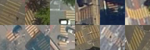

[](LICENSE)
[](https://www.codacy.com/app/marcelhuberfoo/OSM-Crosswalk-Detection)
[](https://travis-ci.org/geometalab/OSMDeepOD)
[](http://waffle.io/geometalab/OSM-Crosswalk-Detection)


#  OSMDeepOD - OSM and Deep Learning based Object Detection from Aerial Imagery 

OSMDeepOD is a project about object detection from aerial imagery using open data from OpenStreetMap (OSM).
The project uses the open source software library TensorFlow, with a retrained Inception V3 neuronal network.

This work started as part of a semester thesis autumn 2015 at Geometa Lab, University of Applied Sciences Rapperswil (HSR). See [Twitter hashtag #OSMDeepOD](https://twitter.com/hashtag/OSMDeepOD) for news.

## Material 
 * [Paper AGIT 2016 (de) by S. Keller & S. Kurath, 7.7.2016](http://gispoint.de/gisopen-paper/3875-erkennung-von-fussgaengerstreifen-aus-orthophotos/agit.html?IDjournalTitle=5&tx_browser_pi1[IDedition]=5)
 * Presentation (en) by S. Keller at GEOSmart Innovation Day 2016: tba.
 * [Presentation (en/de) by S. Bühler at PyDataZRH, 6.12.2016](https://twitter.com/SeverinBuhler/status/803193080211996672)
 * tba.

## Overview


## Process


## Getting Started
The simplest way to use the detection process is to clone the repository and build/start the docker container.

```
git clone https://github.com/geometalab/OSMDeepOD.git
cd OSMDeepOD/docker/
sudo docker build . -t osmdeepod
sudo docker run -it --name osmdeepod -v ./:/objects osmdeepod bash
```

After the previous shell commands you have started a standalone instance of OSMDeepOD and you are connected to it.
If you have a nvida GPU and nvidia-docker installed, you could use the "nvidia-docker" command to run the container for automatically usage of the GPU<sup id="a1">[1](#GPU)</sup>.

To start the detection process use the src/role/main.py<sup id="a2">[2](#main)</sup> script.

1. Use the manger option to select the detection area and start the detection with the --standalone parameter.
```
python3 main.py --config ./config.ini --standalone manager 9.345101 47.090794 9.355947 47.097288
```

After the detection process has finished a "detected_nodes.json" file will appear with the results.
If you like to use OSMDeepOD in a more parallel and distributed way have a look at the https://github.com/geometalab/OSMDeepOD-Visualize repository.
There you have got the ability to use redis as a message queue and you can run many OSMDeepOD instances as workers.

### Configuration
The configuration works with an INI file.
The file looks like the following:
```
[DETECTION]
Network = /path/to/the/trained/convnet
Labels = /path/to/the/label/file/of/the/convnet
DetectionBarrier = 0.99
Word = crosswalk
Key = highway
Value = crossing
ZoomLevel = 19
Compare = yes
Orthofoto = other
FollowStreets = yes
StepWidth = 0.66

[REDIS]
Server = 127.0.0.1
Port = 40001
Password = crosswalks
BboxSize = 2000
Timeout = 5400
```

Some hints to the config file:
 - "Word" is the key value of the labels file
 - "Key" and "Value" builds the search Tag for OSM
 - "Compare" means compared to OSM tagged Nodes
 - "StepWidth" regulates the distance between the cut out images
 - The section REDIS should be self explanatory, this is not necessary in the standalone mode
 - "BboxSize" is the size in meters of the split large Bbox
 - "Timeout" after the expired time the job does fail


### Own Orthofotos
To use your own Orthofotos you have to do the following steps:

1. Add a new directory to `src/data/orthofoto`
2. Add a new module to the directory with the name: <code><var>&lt;your_new_directory></var>_api.py</code>
3. Create a class in the module with the name: <code><var>&lt;Your_new_directory></var>Api</code> (First letter needs to be uppercase)
4. Implement the function `def get_image(self, bbox):` and returns a pillow image of the bbox
5. After that you can use your api with the parameter <code>--orthofots <var>&lt;your_new_directory></var></code>

If you have problems with the implementation have a look at the wms or other example.


## Dataset
During this work, we have collected our own dataset with swiss crosswalks and non-crosswalks. The pictures have a size of 50x50 pixels and are available by request.



Picture 3: Crosswalk Examples


Picture 4: No Crosswalk Examples


## Prerequisites

- Python

  At the moment, we support python 3.5

- Docker

  In order to use volumes, I recommend using docker >= 1.9.x

- Bounding Box of area to analyze

  To start the extraction of crosswalks within a given area, the bounding box of this area is required as arguments for the manager. To get the bounding box the desired area, you can use https://www.openstreetmap.org/export to select the area and copy paste the corresponding coordinates. Use the values in the following order when used as positional arguments to manager: `left bottom right top`


## Links
- http://wiki.hsr.ch/StefanKeller/SA_BA_Gamified_Extraction_of_Crosswalks_from_Aerial_Images
- www.hsr.ch
- www.osm.org
- www.maproulette.org


## Notes
 - <a name="GPU">1</a>: The crosswalk_detection container is based on the nvidia/cuda:7.5-cudnn4-devel-ubuntu14.04 image, may you have to change the base image for your GPU. [↩](#a1)
 - <a name="main">2</a>: For more information about the main.py use the -h option. [↩](#a2)


## Keywords
Big Data; Data Science; Data Engineering; Machine Learning; Artificial Intelligence; Neuronal Nets; Imagery; Volunteered Geographic Information; Crowdsourcing; Geographic Information Systems; Infrastructure; Parallel Programming.
